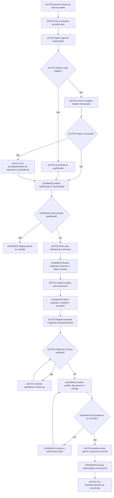

# Escopo do Plano — AHM Solution do Brasil

**Empresa:** AHM Solution do Brasil  
**Processo master:** Jornada Comercial — da captura e qualificação do lead ao pedido, faturamento e ativação de pós-venda  
**Vídeos-fonte:**
1. *WhatsApp Video 2026-08-26 at 15.21.18.mp4*
2. *WhatsApp Video 2026-08-28 at 17.02.23.mp4*
3. *WhatsApp Video 2026-08-28 at 17.02.31.mp4*
4. *WhatsApp Video 2026-08-28 at 17.02.44.mp4*
5. *WhatsApp Video 2026-08-28 at 17.02.50.mp4*  
**Arquivos de contexto usados:** Contexto do cliente; DMO; `AHM.pdf`  
**Data:** 29/08/2026  

> **Nota sobre o arquivo `AHM.pdf`:** embora legível, seu conteúdo descreve um projeto de outra empresa, “ABC Logística S.A.”, com CNPJ, pessoas, objetivos e operação não aderentes à AHM Solution. Por isso, ele foi identificado como material inconsistente e **não foi usado como fonte para regras, dados ou decisões deste escopo**.

---

## 2. Objetivo do sistema

A jornada comercial atual depende de alternância manual entre e-mail, plataforma de WhatsApp, RD Station, Pipedrive e Omie. Isso gera duplicidade de cadastros, atualização manual de responsáveis e etapas, perda de contexto entre áreas e demora para reagir a leads que abandonam a triagem ou a clientes que ainda não enviaram o Pedido de Compra.

O gargalo consolidado não é apenas uma tela ou uma etapa: é a **fragmentação da jornada e a transferência manual de informações entre canais, CRM e ERP**. Ela aparece desde a entrada de leads até o faturamento recorrente, exigindo que pessoas repitam registros, anexem os mesmos documentos em mais de um local e controlem pendências por memória, e-mail ou consulta manual.

O sistema proposto deverá organizar a jornada comercial reformada de ponta a ponta, criando uma operação orientada por status, responsáveis, pendências e regras de negócio. Ele atenderá principalmente Pré-vendas, Comercial, Vendas/Operações, Implantação/Pós-venda e, quando aplicável, Financeiro/Faturamento.

### Resultado esperado

- Reduzir esforço administrativo repetitivo de vendas e operações.
- Garantir que cada lead, proposta, Pedido de Compra e pedido de venda tenha responsável, status e próxima ação claros.
- Padronizar a qualificação técnica e comercial.
- Diminuir perda de contexto entre WhatsApp, e-mail, CRM e ERP.
- Criar uma fila operacional para recuperar abandonos, acompanhar propostas e cobrar documentos pendentes.
- Apoiar escala comercial sem aumento proporcional de equipe.

---

## 2.1 Resumo da entrega

Será entregue um sistema de gestão da jornada comercial que centraliza o acompanhamento de leads, qualificação, propostas, pedidos, pendências, transições entre áreas e atividades de pós-venda. Pré-vendedores, vendedores, analistas de operações e responsáveis pela implantação usarão o sistema para trabalhar em uma fila única, registrar decisões e acompanhar cada oportunidade até sua ativação e recorrência.

---

## 3. Visão geral do fluxo reformado

### Consolidação do fluxo atual

O fluxo real consolidado é:

1. Lead entra por formulário do site, botão de WhatsApp, e-mail ou recorrência de cliente.
2. RD Station, e-mail e plataforma de WhatsApp registram partes diferentes do mesmo contato.
3. Pré-vendas realiza ou complementa a triagem.
4. O lead é movido manualmente no Pipedrive e recebe um responsável.
5. Comercial aprofunda diagnóstico técnico, coleta dados, fotos, dimensões, modal, perdas e volumes.
6. Comercial elabora orçamento no Omie, consulta crédito e envia proposta.
7. A operação aguarda o Pedido de Compra do cliente.
8. Pedido é conferido, registrado no Omie e duplicado no Pipedrive.
9. A tributação é revisada manualmente por item.
10. Após conferência, ocorre faturamento, emissão de DANFE, acionamento de coleta e handoff para implantação/pós-venda.

### Redesenho por rota

| Atividade atual | Rota no escopo base | Justificativa |
|---|---|---|
| Monitorar simultaneamente Outlook, WhatsApp e CRM para identificar novos leads | **ELIMINAR** | A consulta repetida a múltiplas telas não agrega valor ao lead nem à venda. |
| Atribuir manualmente o proprietário do lead | **AUTOMAÇÃO DETERMINÍSTICA** | A distribuição pode obedecer a regras objetivas de disponibilidade, fila ou carteira, após validação da política comercial. |
| Mover manualmente etapas quando ocorre um evento conhecido | **AUTOMAÇÃO DETERMINÍSTICA** | Mudanças como “triagem concluída”, “diagnóstico enviado”, “PO recebido” e “pedido conferido” podem atualizar status por regras claras. |
| Preencher diagnóstico em PDF estático | **ELIMINAR** | O PDF deixa de ser o instrumento operacional de coleta; seus dados passam para um formulário estruturado. |
| Realizar diagnóstico técnico, interpretar fotos, avaliar aplicação e definir solução | **MANTER HUMANO** | Exige julgamento comercial e técnico, especialmente em aplicações industriais e de risco. O sistema organiza os dados e pendências. |
| Conferir dados do Pedido de Compra, faturamento e entrega | **MANTER HUMANO** | A validação tem responsabilidade comercial, fiscal e operacional. O sistema apresenta comparativos e exige registro da decisão. |
| Copiar manualmente valor, pedido e documentos entre CRM e ERP | **AUTOMAÇÃO DETERMINÍSTICA** | São dados estruturados e repetitivos, com risco de divergência. |
| Digitar mensalmente alíquota tributária por item | **AUTOMAÇÃO DETERMINÍSTICA** | O sistema pode aplicar a alíquota vigente previamente aprovada, mantendo histórico de vigência e exigindo validação humana em exceções. |
| Enviar lembretes de proposta, PO pendente, implantação e pós-venda | **AUTOMAÇÃO DETERMINÍSTICA** | Prazos, status e ausência de resposta são eventos objetivos. |
| Aprovar exceção de crédito, faturamento sem PO ou condição comercial fora da regra | **MANTER HUMANO** | Envolve alçada, risco financeiro e responsabilidade decisória. |

### Fluxo to-be do escopo base

---

## 4. Funcionalidades

### 4.1 Jornada única de lead, oportunidade e pedido

- **O que faz:** cria uma visão única do relacionamento, reunindo origem, dados de contato, histórico de qualificação, estágio comercial, proposta, Pedido de Compra, situação de faturamento e próxima ação.
- **Para quem:** Pré-vendas, Comercial, Vendas/Operações e Pós-venda.
- **Dor resolvida:** dispersão entre Outlook, plataforma de WhatsApp, RD Station, Pipedrive e Omie.
- **Evidência:** vídeos de triagem e CRM, `00:00–02:41`; jornada comercial e orçamento, `00:00–12:19`; pedido recorrente, `02:55–04:10`.
- **Rota:** automação determinística.

### 4.2 Distribuição e propriedade automática de leads

- **O que faz:** atribui um responsável ao novo lead conforme regra comercial validada, evitando a conta genérica `Marketing` como proprietário operacional.
- **Para quem:** Pré-vendas e liderança comercial.
- **Dor resolvida:** troca manual de proprietário e risco de lead sem dono ou tratado em duplicidade.
- **Evidência:** vídeos de triagem e CRM, `02:15`.
- **Rota:** automação determinística.

### 4.3 Fila de trabalho e pendências comerciais

- **O que faz:** apresenta ao usuário suas ações pendentes, incluindo novo lead, triagem incompleta, abandono de bot, diagnóstico incompleto, proposta sem retorno, PO pendente, pedido com divergência e pós-venda programado.
- **Para quem:** Pré-vendas, Comercial e Vendas/Operações.
- **Dor resolvida:** acompanhamento manual por e-mail, consulta de telas e dependência de memória individual.
- **Evidência:** abandono do bot, `01:25`; aguardo de PO, `12:59`; follow-up pós-venda, `03:39`.
- **Rota:** automação determinística.

### 4.4 Diagnóstico comercial e técnico estruturado

- **O que faz:** substitui o PDF `Diagnóstico SHOCKWATCH®` por um formulário estruturado com as perguntas já utilizadas pela AHM, permitindo preenchimento progressivo pelo cliente e pela equipe.
- **Para quem:** Pré-vendas, Comercial e cliente.
- **Dor resolvida:** baixa taxa de preenchimento, dados desconexos e coleta repetida em reunião.
- **Evidência:** `Diagnostico_Shockwatch`, `00:28–07:05`.
- **Rota:** automação determinística para coleta e validações; apoio à etapa humana para análise técnica.

### 4.5 Regras de qualificação e encaminhamento comercial

- **O que faz:** aplica regras conhecidas de bloqueio, alerta ou encaminhamento, como restrição de produto para modal aéreo e indicação de necessidade de múltiplos dispositivos em equipamentos de grande porte.
- **Para quem:** Pré-vendas e Comercial.
- **Dor resolvida:** risco de recomendação inconsistente e dependência de conhecimento individual.
- **Evidência:** `Diagnostico_Shockwatch`, `02:27–03:34`.
- **Rota:** automação determinística para alertas; decisão final humana.

### 4.6 Controle de proposta, documentação e Pedido de Compra

- **O que faz:** registra proposta enviada, documentos recebidos, validade, condição comercial, prazo de entrega, tipo de frete, moeda e situação do Pedido de Compra.
- **Para quem:** Comercial e Vendas/Operações.
- **Dor resolvida:** espera não monitorada pelo PO e documentos anexados manualmente em mais de um local.
- **Evidência:** jornada comercial, `08:52–13:38`; pedido recorrente, `00:17–04:10`.
- **Rota:** automação determinística para status e lembretes; apoio à conferência humana.

### 4.7 Controle de exceções de crédito, condição comercial e faturamento

- **O que faz:** apresenta a condição de pagamento definida, registra resultado da consulta de crédito e encaminha situações fora da regra para aprovação humana.
- **Para quem:** Comercial, diretoria e Vendas/Operações.
- **Dor resolvida:** decisão não formalizada para restrições de crédito ou condições especiais.
- **Evidência:** jornada comercial, `08:52–10:14`.
- **Rota:** apoio à etapa humana.

### 4.8 Sincronização operacional de status e documentos

- **O que faz:** evita que a equipe precise recriar manualmente no CRM informações já registradas no ERP, como cliente, valor, status de pedido, situação de venda ganha e documento vinculado.
- **Para quem:** Comercial e Vendas/Operações.
- **Dor resolvida:** recriação do pedido e reenvio do mesmo PDF em Omie e Pipedrive.
- **Evidência:** pedido recorrente, `02:03–04:10`; jornada comercial, `11:15–12:19`.
- **Rota:** automação determinística.

### 4.9 Controle de pré-faturamento e parâmetros tributários

- **O que faz:** registra a alíquota aplicável por período de vigência, destaca pedidos que não possuem parâmetro aprovado e organiza a conferência antes do faturamento.
- **Para quem:** Vendas/Operações e responsável fiscal.
- **Dor resolvida:** digitação manual item a item da alíquota do Simples Nacional e risco fiscal.
- **Evidência:** pedido recorrente, `05:35–06:48`.
- **Rota:** automação determinística, com aprovação humana da informação fiscal.

### 4.10 Handoff para implantação e acompanhamento de recorrência

- **O que faz:** ao confirmar a venda, gera uma solicitação estruturada para implantação/treinamento e cria acompanhamento futuro de pós-venda e recompra.
- **Para quem:** Comercial, Implantação e Pós-venda.
- **Dor resolvida:** transferência de contexto por e-mail e atividade criada manualmente.
- **Evidência:** jornada comercial, `13:59–15:52`; pedido recorrente, `03:39`.
- **Rota:** automação determinística para criação e agendamento; execução humana.

---

## 5. Regras de negócio

1. **[REGRA ATUAL OBSERVADA]** Leads originados pelo RD Station entram no Pipedrive em `Entrada de Leads`, com proprietário inicial `Marketing`.  
   **Fonte:** vídeos de triagem, `01:54–02:15`.

2. **[PROPOSTA]** Todo novo lead deve receber responsável operacional automaticamente, conforme uma regra de distribuição formal aprovada pela liderança comercial.

3. **[REGRA ATUAL OBSERVADA]** Se o lead não responde ao chatbot de WhatsApp, a equipe realiza contato ativo por telefone, e-mail ou WhatsApp.  
   **Fonte:** vídeos de triagem, `01:25–01:26`.

4. **[PROPOSTA]** Um abandono de triagem deve criar pendência de contato com prazo e responsável, em vez de depender da leitura do e-mail de notificação.

5. **[REGRA ATUAL OBSERVADA]** A qualificação deve levantar dor financeira/perda operacional e modal de transporte antes do encaminhamento da proposta.  
   **Fonte:** jornada comercial, `02:40`; `Diagnostico_Shockwatch`, `03:59–05:45`.

6. **[REGRA ATUAL OBSERVADA]** Para modal aéreo, não devem ser utilizados registradores de impacto com bateria interna não removível.  
   **Fonte:** `Diagnostico_Shockwatch`, `02:27`.

7. **[REGRA ATUAL OBSERVADA]** Equipamentos ou embalagens de grandes dimensões podem exigir dois ou mais dispositivos de monitoramento.  
   **Fonte:** `Diagnostico_Shockwatch`, `03:34`.

8. **[REGRA ATUAL OBSERVADA]** A falta de preenchimento completo do diagnóstico não impede a reunião de apresentação; fotos, vídeos e informações faltantes podem ser solicitados posteriormente.  
   **Fonte:** `Diagnostico_Shockwatch`, `06:53–07:05`.

9. **[REGRA ATUAL OBSERVADA]** O negócio qualificado é transferido de Pré-vendas para Comercial, normalmente na etapa de Refinamento.  
   **Fonte:** jornada comercial, `05:37`; `Diagnostico_Shockwatch`, `09:25`.

10. **[REGRA ATUAL OBSERVADA]** Na análise de crédito, empresas aprovadas podem receber condição de 21 dias; novos riscos ou restrições são direcionados para pagamento antecipado ou à vista.  
    **Fonte:** jornada comercial, `08:52–10:14`.

11. **[REGRA ATUAL OBSERVADA]** A data de `Previsão de Faturamento` recalcula a data de vencimento das parcelas.  
    **Fonte:** jornada comercial, `10:14`.

12. **[REGRA ATUAL OBSERVADA]** Nenhuma compra de suprimentos ou separação de estoque deve iniciar sem o Pedido de Compra formal do cliente.  
    **Fonte:** jornada comercial, `12:15`.

13. **[REGRA ATUAL OBSERVADA]** Em pedidos recorrentes com transferência bancária, `Gerar Boleto` permanece como `Não`.  
    **Fonte:** pedido recorrente, `04:42–05:30`.

14. **[REGRA ATUAL OBSERVADA]** Itens importados em estoque local devem utilizar a origem fiscal `1 - Estrangeira - Importação direta`.  
    **Fonte:** pedido recorrente, `05:35–06:17`.

15. **[PROPOSTA]** Toda alteração de alíquota fiscal deverá ter responsável, data de vigência e registro de aprovação antes de ser aplicada aos pedidos.

---

## 6. Automações

| Automação | Gatilho | Regra | Resultado | Atividade manual eliminada | Ganho esperado |
|---|---|---|---|---|---|
| Criação ou atualização de jornada | Entrada de formulário, WhatsApp ou pedido | Identificar contato e organização já existentes conforme critérios validados | Lead ou pedido aparece na fila única | Buscar e recriar registro em telas diferentes | Menos duplicidade e menor risco de perda |
| Distribuição de responsável | Novo lead elegível | Aplicar regra aprovada de carteira, rodízio ou disponibilidade | Proprietário e próxima ação definidos | Troca manual de `Marketing` para SDR | Redução de cliques e risco de lead sem dono |
| Alerta de abandono de triagem | Ausência de resposta dentro do prazo definido | Criar pendência de recuperação | SDR recebe ação priorizada | Monitorar e-mail e chat manualmente | Menor tempo de primeiro contato |
| Atualização de etapa | Triagem concluída, diagnóstico concluído, proposta enviada, PO recebido ou pedido validado | Atualizar status conforme evento | Jornada reflete situação atual | Alterar manualmente pipeline e etapa | Menor desalinhamento entre áreas |
| Formulário de diagnóstico | Envio de qualificação ou reunião agendada | Solicitar e validar campos já existentes no PDF | Dados ficam estruturados e pendências ficam visíveis | Enviar, preencher e interpretar PDF manualmente | Redução de lacunas em reuniões |
| Lembretes comerciais | Proposta enviada ou PO pendente | Aplicar cadência aprovada de acompanhamento | Tarefa para responsável | Controle por memória ou e-mail | Menor esquecimento de follow-up |
| Atualização de venda e pós-venda | Pedido validado e venda confirmada | Criar transição para implantação e acompanhamento futuro | Handoff estruturado e ação futura criada | Criar negócio ganho e atividade manualmente | Menos perda de contexto |
| Aplicação de parâmetro fiscal vigente | Pedido em pré-faturamento | Aplicar alíquota previamente aprovada e vigente | Pedido sinaliza condição fiscal aplicada ou pendência | Digitar percentual item a item | Redução de tempo e risco fiscal |

**[EVOLUÇÃO IA]** A análise de fotos, vídeos e respostas abertas do diagnóstico pode futuramente receber apoio de IA generativa pontual, mas não é necessária para o funcionamento do escopo base.

---

## 7. Fluxos do usuário

### 7.1 Pré-vendas

1. Acessa a fila de novos leads e pendências.
2. Visualiza origem, dados cadastrais, canal de entrada e respostas da triagem.
3. Assume os leads atribuídos automaticamente ou trata exceções de distribuição.
4. Realiza contato humano por WhatsApp, telefone ou e-mail.
5. Completa ou revisa a qualificação estruturada.
6. Define se o lead deve continuar em qualificação, ser nutrido/perdido ou encaminhado ao Comercial.
7. O sistema atualiza a etapa e registra a próxima ação conforme a decisão.

### 7.2 Comercial

1. Recebe a oportunidade em Refinamento com o histórico anterior.
2. Visualiza diagnóstico, fotos, dimensões, modal, embalagem, perdas, volume e contatos relacionados.
3. Avalia tecnicamente a aplicação e solicita complementos quando necessário.
4. Define solução, proposta, condição comercial e necessidade de análise de crédito.
5. Registra o envio da proposta e acompanha a pendência de retorno ou PO.
6. Confere o Pedido de Compra recebido e registra eventual divergência.
7. Confirma a venda ou solicita aprovação de exceção.

### 7.3 Vendas/Operações

1. Recebe pedido confirmado e documentação vinculada.
2. Confere dados de faturamento, entrega, itens, pagamento, previsão de faturamento e tributação.
3. Visualiza alertas de dados faltantes, divergências ou parâmetro fiscal não aprovado.
4. Ajusta apenas as informações sob sua responsabilidade.
5. Registra que o pedido está apto para faturamento ou devolve para correção.
6. Conclui a transição operacional para emissão, envio de DANFE e coleta, conforme processo externo.

### 7.4 Implantação/Pós-venda

1. Recebe solicitação de implantação com contexto comercial e técnico.
2. Agenda treinamento ou atividade de aplicação.
3. Registra andamento, pendências e conclusão da implantação.
4. O sistema cria a atividade futura de acompanhamento de recorrência.
5. A equipe utiliza o histórico para identificar possibilidade de recompra.

### 7.5 Liderança comercial

1. Acompanha fila por responsável, origem, estágio e pendências.
2. Identifica leads sem atendimento, propostas sem retorno, POs parados e exceções aguardando aprovação.
3. Ajusta regras de distribuição quando aprovadas.
4. Analisa indicadores de resposta, conversão, tempo em etapa e recorrência.

---

## 8. Dados e informações necessárias

| Informação | Origem |
|---|---|
| `Identificador`, `Criado em`, `Conversion url`, `Conversion domain`, `Email lead`, `User agent`, `Device`, `Asset id`, `Conversion payload`, `Empresa`, `Nome`, `Telefone`, `Cargo`, `Canal de origem` | RD Station / entrada de lead |
| Histórico de páginas visitadas, ativos acessados e automações concluídas | RD Station Marketing |
| Opção de atendimento, produto, faixa de temperatura, quantidade, prazo, perdas e dor enfrentada | Chatbot e atendimento humano |
| `Nome`, `E-mail comercial`, `Telefone`, `Empresa`, `Cargo`, `Endereço` | Diagnóstico e cadastro comercial |
| Problema de manuseio, distribuição, cliente inicial/final, modal, frete, embalagem, dimensões, peso e modo de embarque | Diagnóstico estruturado |
| Quantidade de embarques, produção, avarias, reaproveitamento, descarte e preço de venda | Diagnóstico estruturado |
| Fotos, vídeos, procedimento de claims, departamento responsável, contato de claims e sistema de monitoramento atual | Cliente e equipe comercial |
| Pipeline, etapa, proprietário, organização, pessoa, mensagem, origem, comercial, produto e segmento do cliente | CRM / operação comercial |
| CNPJ, ficha cadastral, condição de pagamento, frete, moeda, prazo de entrega e previsão de faturamento | Cliente, Comercial e Omie |
| Número do pedido, itens, quantidade, valor, local de faturamento, local de entrega e condições de pagamento | Pedido de Compra e Omie |
| CFOP, origem do item, enquadramento tributário e alíquota aplicável | Omie e responsável fiscal/contabilidade |
| Orçamento, Pedido de Compra, DANFE, espelho de Nota Fiscal e documentos de implantação | Cliente, Comercial, Operações e processos externos |
| Situação da implantação, treinamento e próxima ação de pós-venda | Implantação/Pós-venda |

---

## 9. Evoluções sugeridas com IA (opcional — fora do escopo base)

O sistema descrito neste escopo funciona integralmente sem IA. As possibilidades abaixo são evoluções posteriores, somente após a operação determinística estar estabilizada.

### 9.1 Apoio à leitura de evidências técnicas do cliente

- **Etapa de origem:** refinamento técnico e diagnóstico com fotos, vídeos e descrições de avarias.
- **Tipo:** IA generativa pontual.
- **O que faria:** resumiria o material enviado pelo cliente e destacaria informações potencialmente relevantes, como tipo de dano relatado, modalidade mencionada, embalagem, frequência de avarias e dados ausentes.
- **O que ganharia:** redução do tempo de leitura inicial e melhor preparação para a reunião técnica.
- **Trade-off:** custo por processamento, possibilidade de interpretação incompleta e necessidade de validação pelo consultor.
- **Limite:** a IA não recomendaria automaticamente produto, quantidade de dispositivos, condição comercial ou decisão de venda. O consultor manteria a decisão.

### 9.2 Apoio à redação de follow-ups comerciais

- **Etapa de origem:** proposta enviada, PO pendente ou dados de diagnóstico incompletos.
- **Tipo:** IA generativa pontual.
- **O que faria:** sugeriria rascunhos de mensagens com base no estágio e nos dados já registrados.
- **O que ganharia:** maior rapidez na elaboração de comunicações.
- **Trade-off:** menor padronização de tom se não houver revisão, custo por execução e necessidade de aprovação humana antes do envio.
- **Limite:** nenhuma mensagem seria enviada automaticamente pela IA no escopo sugerido.

---

## 10. Sugestões estratégicas e alternativas (fora do sistema)

### 10.1 Revisar a política de exigência de Pedido de Compra

**Cadeia de porquês**

1. A venda permanece parada aguardando o PO.
2. O pedido interno, separação de estoque e faturamento dependem do documento.
3. A regra protege a empresa contra venda sem aceite formal.
4. O aceite formal hoje é tratado como sinônimo de PDF de PO.
5. **[HIPÓTESE]** Pode haver clientes ou situações em que outro mecanismo formal de aceite seja juridicamente e comercialmente aceitável.

**O que muda:** avaliar, com Jurídico, Financeiro e liderança comercial, se determinados perfis de cliente poderiam usar modalidade alternativa de aceite formal.

**Benefício esperado:** redução do tempo parado entre proposta e liberação operacional.

**O que validar:** quais clientes, valores, produtos, riscos e situações podem aceitar alternativa ao PO sem comprometer compliance, cobrança ou saúde financeira.

---

### 10.2 Simplificar a qualificação antes de digitalizá-la integralmente

**Cadeia de porquês**

1. O diagnóstico possui 22 perguntas e frequentemente volta incompleto.
2. O cliente enfrenta atrito para preencher um PDF longo.
3. O consultor precisa recuperar informações em reunião.
4. Parte dos dados pode não ser necessária em todos os tipos de solução.
5. **[HIPÓTESE]** O questionário pode estar misturando dados obrigatórios de triagem, dados de refinamento e dados úteis apenas para casos específicos.

**O que muda:** revisar o diagnóstico e separar perguntas em:
- triagem obrigatória;
- perguntas condicionais por produto/modal;
- aprofundamento técnico posterior.

**Benefício esperado:** maior taxa de resposta, menor tempo de reunião e melhor experiência para o comprador B2B.

**O que validar:** quais perguntas são decisivas para cada linha de produto e quais podem ser solicitadas apenas após a oportunidade ser qualificada.

---

### 10.3 Formalizar política de distribuição de leads

**Cadeia de porquês**

1. Leads entram inicialmente sob o proprietário `Marketing`.
2. O SDR precisa assumir manualmente o card.
3. Não há evidência de regra formal de quem atende cada lead.
4. Sem regra, a empresa depende de disponibilidade percebida ou ordem de chegada.
5. **[HIPÓTESE]** A ausência de critério pode gerar desequilíbrio de carteira, atrasos e disputa silenciosa de oportunidades.

**O que muda:** definir se a distribuição será por rodízio, carteira, produto, região, idioma, capacidade ou prioridade.

**Benefício esperado:** atendimento mais previsível e melhor gestão de produtividade.

**O que validar:** tamanho do time, especialidades, regiões atendidas, operação Brasil/EUA e regras de substituição em ausências.

---

### 10.4 Instituir rotina fiscal mensal com responsável e validação

**Cadeia de porquês**

1. A alíquota do Simples Nacional é digitada manualmente por item.
2. O percentual vem de consulta externa à contabilidade.
3. A operação depende de informação mensal fora do fluxo de faturamento.
4. Não há evidência de responsável, prazo e aprovação formal para atualizar o parâmetro.
5. **[HIPÓTESE]** O risco não é apenas operacional; é de governança fiscal e dependência de conhecimento individual.

**O que muda:** estabelecer uma rotina mensal de recebimento, validação, aprovação e vigência do parâmetro fiscal.

**Benefício esperado:** menor risco de emissão com imposto incorreto e redução de conferências repetitivas.

**O que validar:** responsável interno, prazo de atualização, fonte oficial, necessidade de aprovação contábil e como tratar alterações retroativas.

---

## 11. Reflexão final: perguntas, lacunas e causas-raiz

### Perguntas a serem respondidas pelo cliente

| Pergunta | Motivo e impacto no escopo |
|---|---|
| Qual é a porcentagem de leads que abandonam a interação com o chatbot? | Define prioridade, prazo e cadência da automação de recuperação de abandono. |
| Qual é a regra formal de distribuição de leads entre vendedores? | Define a regra determinística de atribuição automática. |
| A plataforma de WhatsApp possui integração ativa com o Pipedrive para criar ou atualizar contatos e histórico? | Define o que precisa ser centralizado e evita duplicar funcionalidade existente. |
| `envya`, `Enya - Agente`, `Envia`, `Emovia` e `envia` são a mesma plataforma ou ferramentas distintas? | Há grafias diferentes nos vídeos. A resposta define o mapa real de sistemas e fluxos. |
| Onde os PDFs de diagnóstico preenchidos são armazenados atualmente? | Define estratégia de migração e rastreabilidade do histórico comercial. |
| O chatbot preenche campos personalizados do Pipedrive automaticamente? | Define quais dados já chegam estruturados e quais precisam ser capturados pela nova jornada. |
| Existe alçada para liberar faturamento sem PO formal em situações de urgência? | Define se o sistema precisa de fluxo de exceção e aprovação. |
| Como é tratada uma restrição de crédito intermediária? Existe aprovação de diretoria? | Define regras de exceção de crédito e responsáveis por decisão. |
| Como a contabilidade comunica mensalmente a alíquota do Simples Nacional? | Define a rotina de atualização e validação do parâmetro fiscal. |
| Existe critério formal para clientes que exigem aprovação prévia do espelho da NF? | Define uma regra de pré-faturamento e comunicação ao cliente. |
| Qual o tempo médio e quais entregáveis compõem a implantação conduzida pela Aline? | Define o nível de detalhe necessário no handoff para Implantação e Pós-venda. |
| O treinamento gera termo de aceite ou checklist? | Define documentos e evidências a registrar no encerramento da implantação. |
| Quais campos são obrigatórios para cada tipo de produto e solução? | Necessário para reduzir o diagnóstico sem perder qualidade técnica. |
| Em quais situações a venda direta pela matriz dos EUA é economicamente e comercialmente viável? | Define eventual regra de encaminhamento comercial internacional. |

### Lacunas de informação

Processos mencionados, mas não demonstrados:

- Elaboração detalhada de proposta comercial e cálculo formal de ROI.
- Ligação telefônica de qualificação.
- Visita técnica presencial.
- Processo de compra/importação e separação de estoque.
- Emissão efetiva da Nota Fiscal.
- Envio da DANFE ao cliente.
- Solicitação de coleta à transportadora.
- Consulta mensal à contabilidade.
- Treinamento de aplicação e implantação.
- Rotina de pós-venda e recompra recorrente.
- Tratamento de leads perdidos, descarte e nutrição.

Vídeos que provavelmente faltam:

1. Demonstração do processo de elaboração de proposta.
2. Demonstração do processo de importação, estoque, expedição e coleta.
3. Demonstração da implantação e treinamento.
4. Demonstração da rotina de pós-venda, recompra e churn.
5. Demonstração da atualização tributária com a contabilidade.
6. Demonstração da governança de crédito e aprovações de exceção.

### Possíveis causas-raiz

1. **Dor declarada:** retrabalho de atualização entre sistemas.  
   **Por trás:** o mesmo evento comercial precisa ser registrado em vários ambientes.  
   **Condição final:** ausência de uma jornada operacional centralizada, com dono, status e regras de sincronização.

2. **Dor declarada:** leads abandonam o bot e exigem contato manual.  
   **Por trás:** a recuperação depende de leitura humana de e-mails e múltiplas telas.  
   **Condição final:** não há política operacional de prazo, responsável e cadência para abandono de triagem.

3. **Dor declarada:** diagnóstico técnico volta incompleto.  
   **Por trás:** o cliente recebe um PDF longo e pouco adaptado ao seu contexto.  
   **Condição final:** **[HIPÓTESE]** o processo ainda não separa claramente triagem obrigatória de aprofundamento técnico condicional.

4. **Dor declarada:** venda fica parada aguardando PO.  
   **Por trás:** a empresa precisa de garantia formal de compra antes de mobilizar operação.  
   **Condição final:** **[HIPÓTESE]** a política atual trata o PDF de PO como única forma possível de aceite, sem segmentar risco, cliente ou exceção.

5. **Dor declarada:** risco e demora no preenchimento tributário.  
   **Por trás:** a informação fiscal depende de consulta externa e digitação manual.  
   **Condição final:** ausência de uma rotina formal de governança, vigência e aprovação do parâmetro tributário.

---

## 12. Rastreabilidade

| Decisão de redesenho | Fonte |
|---|---|
| Eliminar consulta paralela a Outlook, chat e CRM como rotina operacional | Vídeos de triagem, `00:00–02:15`; vídeo de jornada comercial, `00:00–01:25` |
| Automatizar atribuição de responsável | Vídeos de triagem, `02:15` |
| Criar fila de recuperação de abandono do bot | Vídeos de triagem, `01:25–01:26` |
| Digitalizar diagnóstico SHOCKWATCH | `Diagnostico_Shockwatch`, `00:28–07:05` |
| Manter análise técnica de aplicação como decisão humana | `Diagnostico_Shockwatch`, `02:27–06:53`; jornada comercial, `07:03–08:32` |
| Aplicar alertas para modal aéreo e grandes dimensões | `Diagnostico_Shockwatch`, `02:27–03:34` |
| Automatizar mudança de etapa por evento comercial estruturado | Vídeos de triagem, `02:24–02:41`; jornada comercial, `05:37` |
| Controlar proposta e PO pendente por status e follow-up | Jornada comercial, `11:15–13:38` |
| Manter validação do PO, faturamento e entrega sob decisão humana | Jornada comercial, `13:38`; pedido recorrente, `00:17–02:03` |
| Eliminar recriação manual de pedido e anexos em CRM e ERP | Jornada comercial, `11:15–12:19`; pedido recorrente, `02:03–04:10` |
| Criar governança de parâmetro fiscal com vigência | Pedido recorrente, `05:35–06:48` |
| Criar handoff estruturado para implantação e recorrência | Jornada comercial, `13:59–15:52`; pedido recorrente, `03:39` |
| Avaliar alternativa formal ao PO em cenários elegíveis | Jornada comercial, `12:15–13:38` |
| Revisar e dividir o questionário de 22 perguntas por etapa | `Diagnostico_Shockwatch`, `00:28–07:05` |